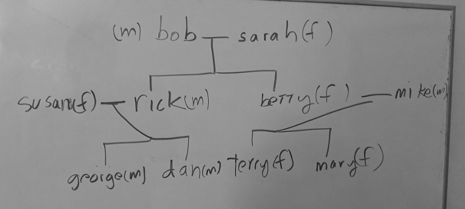

# CS3035 Final

## Part I

Write predicates `male/1`, `female/1`, `son/2`, `daughter/2`, `parent/2`, `mother/2`, `father/2`, `sister/2`, `brother/2`, `uncle/2`, `aunt/2`, `grandmother/2`, `grandfather/2`, where

1. **(10pts)** `son`, `daughter`, `mother`, `father`, `sister`, `brother`, `uncle`, `aunt`, `grandmother`, and `grandfather` are based on other predicates in the first list, and
2. **(3pts)** `male`, `female`, and `parent` are not based on other predicates.
3. All the two place predicates read like this "X is the &lt;your predicate&gt; of Y" where X is the first argument, Y is the second: e.g. `grandmother(X, Y)` reads "X is the grandmother of Y".
4. `brother` and `sister` must not have a person be the brother or sister of him or herself. The same relationship should not be repeated `(X=rick, Y=betty ... X=rick, Y=betty)`, though reciprocal relationships should be listed `(X=george, Y=dan ... X=dan, Y=george)`. Remember that not equals can be represented by `not(X = Y)`.

**(7pts)** Create the family tree below using the above predicates. Represent all of the above relationships with the appropriate facts and rules.



## Part II

The following code gets the last item of a list:

```prolog
last_one(X, [X]).
last_one(X, [_ | L]) :- last_one(X, L).
```

And the following code gets the second to the last item of a list:

```prolog
last_but_one(X, [X, _]).
last_but_one(X, [_, H | T]) :- last_but_one(X, [H | T]).
```

**(5pts)** Write code for `last_but_two/2` to get the third to last item of a list.
