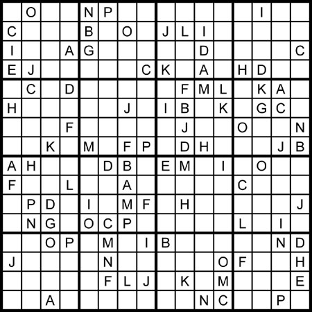

# Homework Five

## Alphahabet Sudoku Solver!

**(15pts)** Write a solver for a 16 by 16 letter sudoku puzzle below (you can use numbers from 1 to 16 as well).

Submit your Prolog file along with a screen shot of your test. You may use the swipl prompt if you want, or run it as a script, or run it in this interpreter found [here](http://swish.swi-prolog.org/example/clpfd_sudoku.pl).

## Extra Credit

**(5pts)** Write it as a script that reads the starting puzzle from a text file, and outputs at least one solution to another text. 
